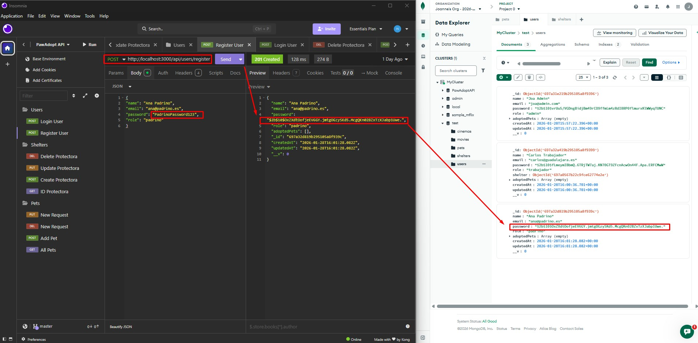
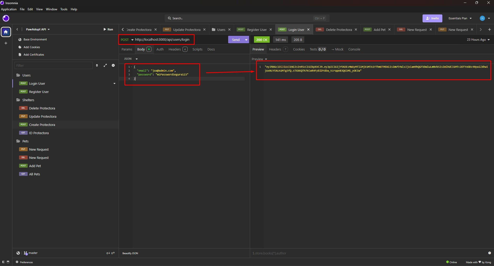
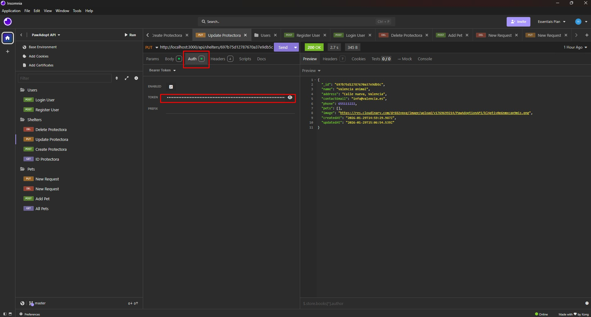
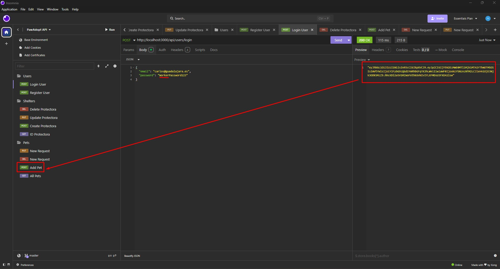
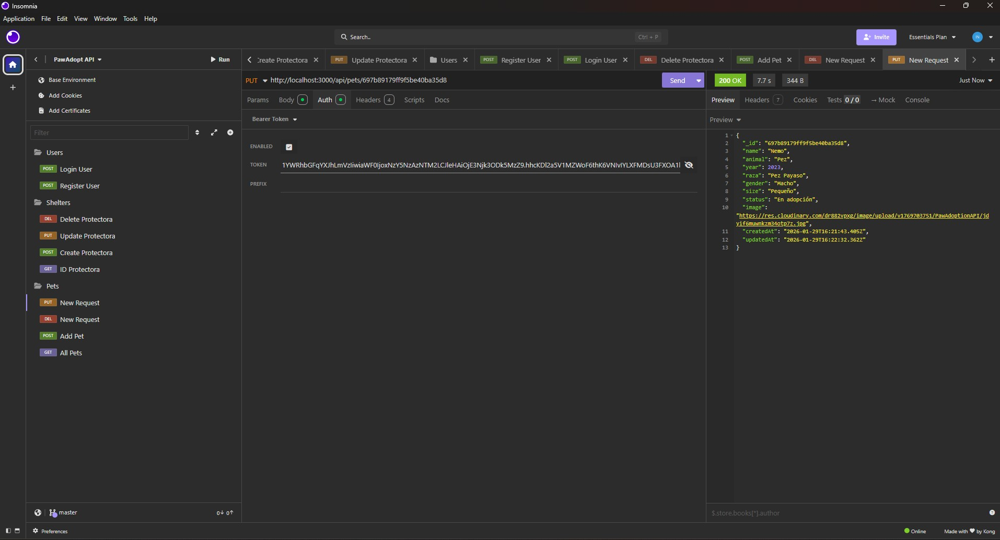
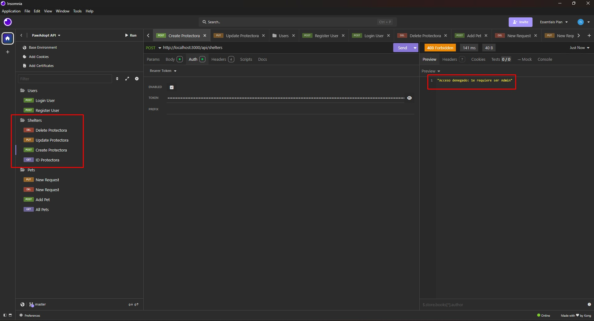
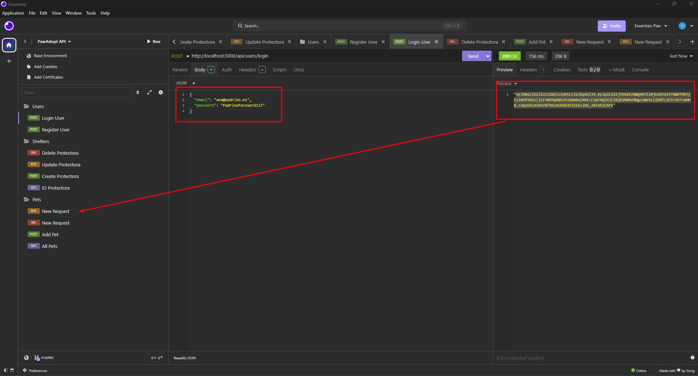
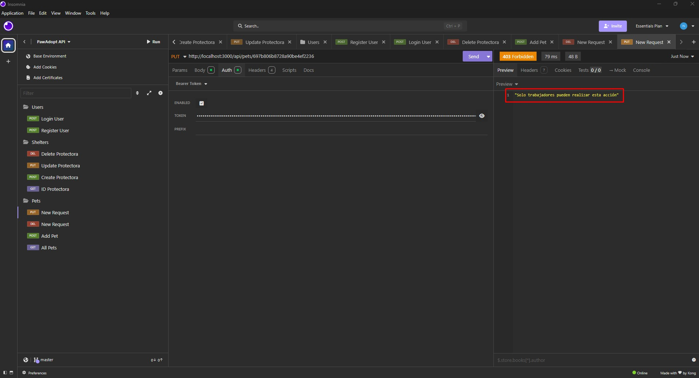

# Documentación: Gestión de Usuarios y Permisos (RBAC)

Este módulo implementa un sistema de **Control de Acceso Basado en Roles (RBAC)** mediante el uso de **JSON Web Tokens (JWT)**. El sistema distingue entre tres tipos de perfiles para garantizar la seguridad de los datos de la protectora.

---

## 1. Registro de Usuarios (Register)

El endpoint de registro permite la creación de nuevos perfiles. El sistema encripta la contraseña antes de almacenarla para cumplir con los estándares de seguridad.

* **Endpoint**: `POST /api/users/register`
* **Validación**: Se comprueba que el email sea único y que la contraseña cumpla con los requisitos mínimos de longitud.

**Register:**

*(En Atlas se observa el campo `password` hasheado y el campo `role` asignado)*.

---

## 2. Inicio de Sesión (Login)

El proceso de autenticación genera un Token que el cliente debe enviar en la cabecera `Authorization` para acceder a rutas protegidas.

* **Endpoint**: `POST /api/users/login`
* **Respuesta**: El servidor devuelve los datos del usuario y el token generado.

**Login:**

---

## 3. Jerarquía de Roles y Accesos CRUD

La seguridad se aplica mediante middlewares que verifican el rol del usuario contenido en el Token.

### A. Rol: Administrador (`admin`)
Es el nivel más alto de acceso. Tiene permisos totales sobre todos los modelos del sistema.

* **Usuarios**: Puede crear, ver, editar y borrar cualquier usuario.
* **Protectoras**: Gestión total del CRUD de protectoras.
* **Animales**: Gestión total del CRUD de animales.

**Token:**

### B. Rol: Trabajador (`worker`)
Perfil orientado a la gestión operativa de los animales sin capacidad de alterar la estructura de la protectora o de otros usuarios.

* **Usuarios**: Solo tiene acceso a la lectura y edición de su propio perfil.
* **Protectoras**: Acceso de solo lectura para consultar datos.
* **Animales**: Gestión total del CRUD (Crear, Editar y Borrar animales).

**Evidencia de funcionamiento:**

**Evidencia de restricción:**

### C. Rol: Usuario (`user`)
Perfil con los permisos más restrictivos, diseñado para adoptantes o visitantes.

* **Usuarios**: Solo puede gestionar su propio perfil.
* **Protectoras**: Solo lectura.
* **Animales**: Solo lectura (consulta de catálogo).
* **Restricción**: Cualquier intento de `POST`, `PUT` o `DELETE` en animales o protectoras devuelve un error `403 Forbidden`.

**Evidencia de restricción:**

---

## 4. Verificación de Seguridad en Rutas

Como se observa en el código de las rutas, se aplican los middlewares `isAuth`, `isAdmin` o `isWorker` según el nivel de sensibilidad de la operación.

> **Nota:** Las capturas de Insomnia muestran que, ante una petición sin el rol adecuado, el sistema responde con un `400 Bad Request` o `403 Forbidden` según la configuración del middleware.