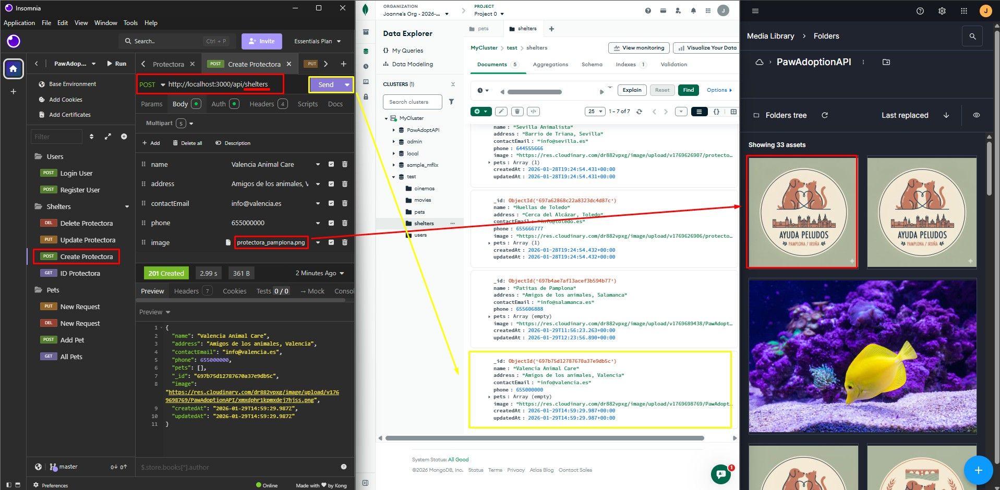
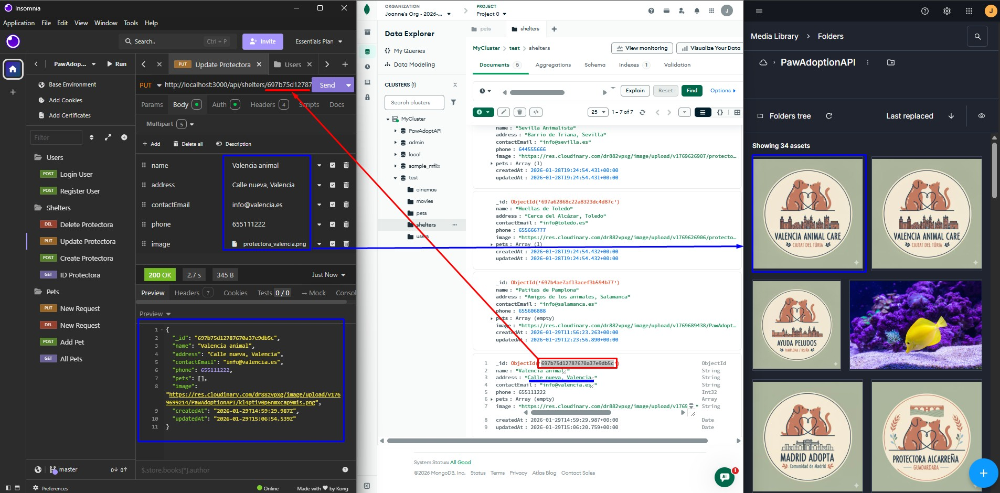
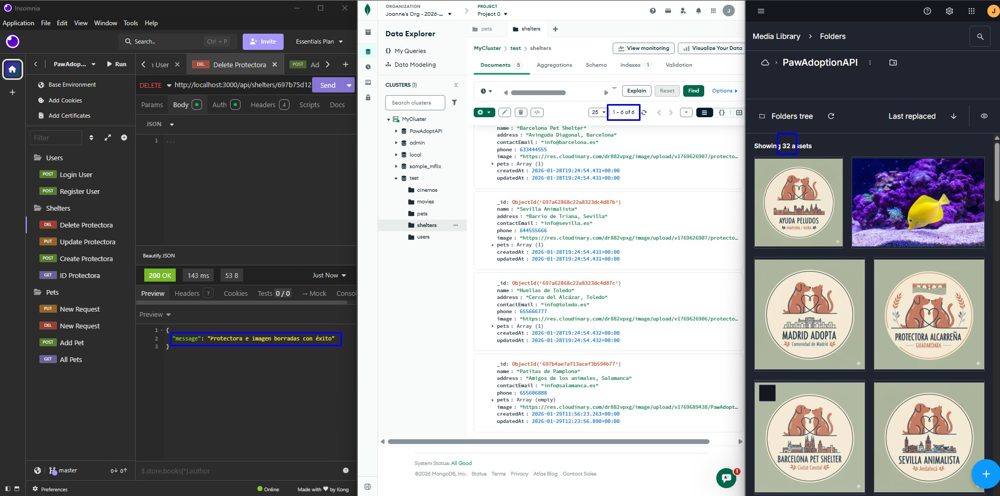

# Documentación: Gestión de Protectoras (Shelters)

Este módulo gestiona la información de las entidades colaboradoras. Debido a la sensibilidad de los datos, el acceso está restringido principalmente al rol de Administrador.

---

## 1. Control de Acceso y Seguridad

El sistema utiliza middlewares de autorización para bloquear peticiones no permitidas.

* **Usuarios y Trabajadores**: Tienen acceso de lectura (GET), pero cualquier intento de modificación (POST, PUT, DELETE) resulta en un error de permisos.
* **Administradores**: Son los únicos perfiles autorizados para realizar el CRUD completo.

**Captura de error (Acceso Denegado):**

---

## 2. Operación POST: Crear Protectora

Para crear una protectora, el Administrador debe enviar un formulario `multipart/form-data` con los datos básicos y un archivo de imagen.

* **Proceso**: La imagen se sube a Cloudinary y la URL resultante se guarda en MongoDB Atlas.

**Evidencias de Creación:**
* **Captura POST**: 

---

## 3. Operación GET: Visualizar Protectoras

Este endpoint permite consultar la información de las protectoras registradas. En nuestro desarrollo, hemos aplicado `.populate("pets")` para traer también la información de los animales asociados.

**Captura de Consulta:**
* **Captura GET**: 

---

## 4. Operación PUT: Modificar Protectora (Cambio de Imagen)

Esta es una de las funciones más complejas. El controlador está diseñado para detectar si se sube una nueva imagen. Si es así, ejecuta dos pasos críticos:
1.  Sube la nueva imagen a Cloudinary.
2.  Elimina la imagen antigua de Cloudinary usando su `public_id` para evitar almacenamiento basura.

**Prueba de actualización:**
* **Captura PUT**: 

---

## 5. Operación DELETE: Eliminar Protectora

Al eliminar una protectora, el sistema no solo borra el registro de MongoDB, sino que también dispara la función `deleteImgCloudinary` para limpiar la nube.

* **Lógica**: Se busca el documento, se extrae la URL de la imagen y se procede al borrado físico en ambos servicios.

**Evidencias de Borrado:**
* **Captura DELETE**: 

---

> **Nota Técnica**: La limpieza automática de Cloudinary en las operaciones PUT y DELETE asegura que el proyecto sea escalable y no genere costes innecesarios por archivos huérfanos.