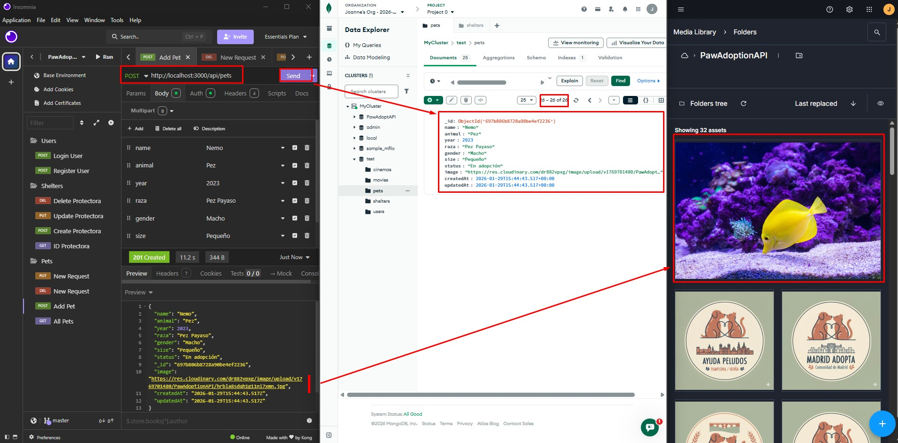
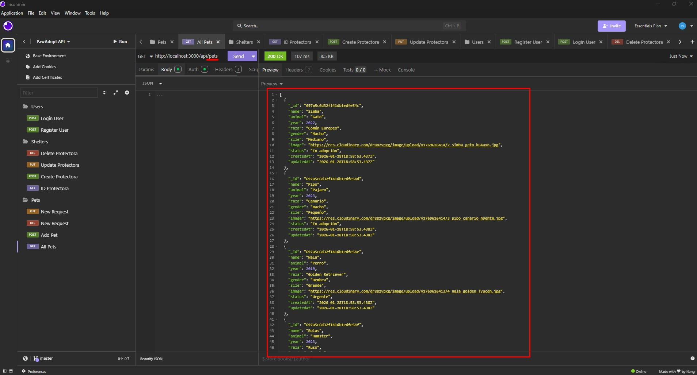
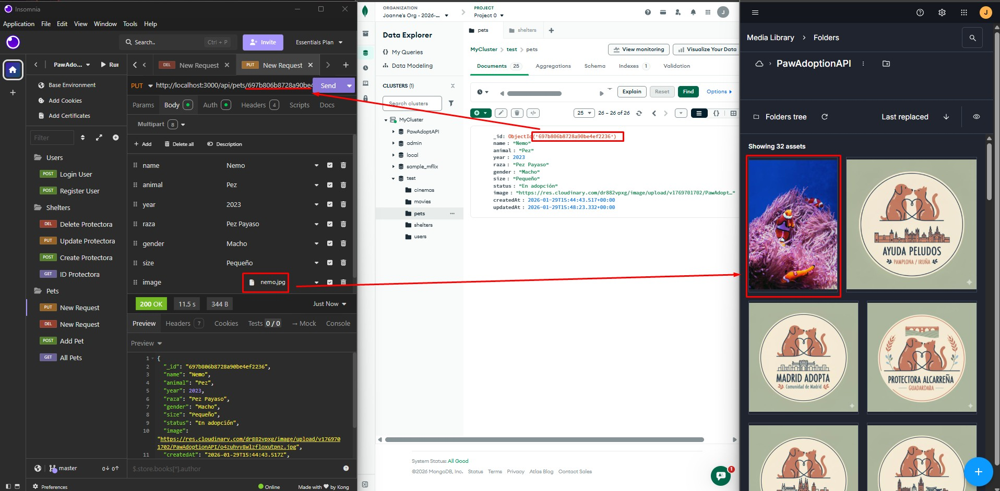
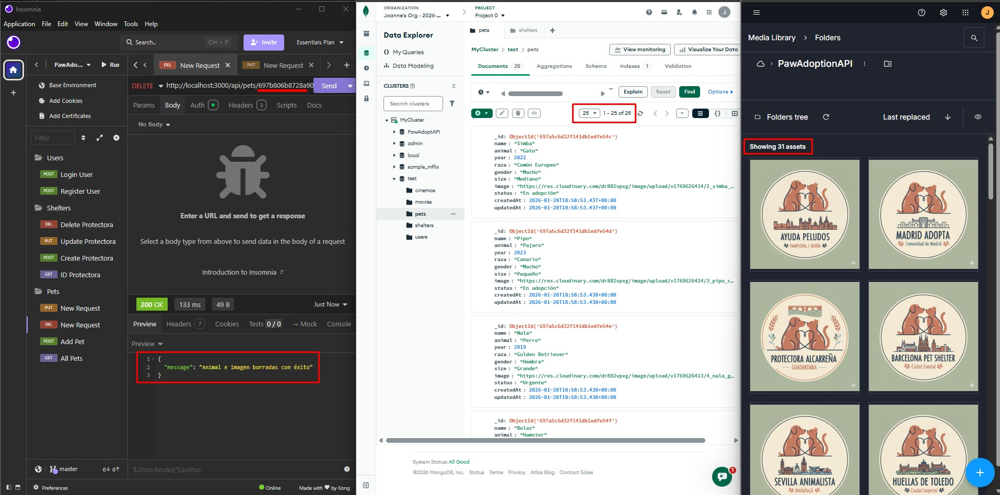

# Documentación: Gestión de Animales (Pets)

Este módulo es el núcleo operativo del proyecto. Permite la gestión de las mascotas disponibles para adopción. A diferencia de las protectoras, este apartado permite el acceso tanto a **Administradores** como a **Trabajadores** para agilizar la gestión diaria.

---

## 1. Control de Acceso y Roles

El acceso a las rutas de animales está protegido para garantizar que solo el personal autorizado pueda modificar los datos.

* **Usuarios (`user`)**: Solo tienen permisos de lectura (GET). Cualquier intento de crear, editar o borrar devolverá un error `403 Forbidden`.
* **Trabajadores (`worker`)**: Tienen permisos completos (CRUD) para gestionar las fichas de los animales.
* **Administradores (`admin`)**: Tienen control total sobre el CRUD de animales.

**Captura de error (Usuario intentando POST):**

---

## 2. Operación POST: Registro de un Animal

Para dar de alta un animal, se requiere completar campos obligatorios como `name`, `animal` y `image`. La imagen es procesada por el middleware de Cloudinary antes de guardar el registro en la base de datos.

**Evidencias de Registro:**
* **Captura POST**: 

---

## 3. Operación GET: Listado y Detalle

Permite a todos los roles (incluidos usuarios) ver los animales disponibles.

* **Captura GET**: 

---

## 4. Operación PUT: Actualización de ficha y cambio de imagen

Cuando un trabajador o administrador actualiza la foto de un animal, el controlador ejecuta la lógica de "limpieza":
1.  Detecta la nueva imagen en `req.file`.
2.  Extrae el `public_id` de la imagen antigua y la borra de Cloudinary para no dejar archivos huérfanos.
3.  Actualiza la URL en MongoDB Atlas con la nueva dirección.

**Prueba de actualización (Cambio de foto de Nemo):**
* **Captura PUT**: 

---

## 5. Operación DELETE: Baja de un Animal

Al eliminar un animal (por ejemplo, tras una adopción), el sistema elimina el registro de la base de datos y borra automáticamente su fotografía de la nube.

**Evidencias de Borrado:**
* **Captura DELETE**: 

---

> **Nota de Seguridad**: El sistema valida que el campo `animal` coincida con los valores permitidos (Pez, Perro, Gato, etc.) mediante el uso de `enum` en el esquema de Mongoose, evitando datos inconsistentes en el CRUD.